<!-- ═══════════════════════════════════════════════════════════════════
     ★  Vatsal Goyal — GitHub Profile README  ★
     ═══════════════════════════════════════════════════════════════════ -->

<div align="center">

  <!-- ▸ ANIMATED HEADER BANNER -->
  

  <br/><br/>

  <!-- ▸ PROFILE VIEWS & SOCIAL BADGES -->
  <a href="https://github.com/TheVatsalGoyal">
    
  </a>
  &nbsp;
  <a href="https://www.linkedin.com/in/YourLinkedIn/">
    
  </a>
  &nbsp;
  <a href="mailto:your.email@example.com">
    
  </a>

</div>

---

## 🧑‍💻 About Me

```text
🔭  Currently building responsive web apps & sharpening my DSA skills
🎓  B.Tech CSE student — relentlessly curious, endlessly learning
🧠  Exploring AI / ML fundamentals and Operating Systems internals
⚡  Fun Fact: I debug better with lo-fi music on 🎧
```

- 🏗️ **Data Structures & Algorithms** — Solving problems daily on LeetCode / Codeforces
- 🧩 **Object-Oriented Programming** — Writing clean, modular, SOLID code in C++ & Python
- 🌐 **Web Development** — Crafting pixel-perfect, responsive UIs with HTML, CSS & JS
- 🤖 **Artificial Intelligence** — Experimenting with ML models, NLP, and neural networks
- 🖥️ **Operating Systems** — Diving into process scheduling, memory management & system calls

---

## 🛠️ Tech Stack

<div align="center">

### Languages


### Frameworks & Tools


</div>

---

## 🚀 Featured Projects

<div align="center">
<table>
<tr>
<td width="50%">

### 🌐 Responsive Portfolio Website
A fully responsive, mobile-first personal portfolio built with **HTML5, CSS3 & JavaScript**.
<br/><br/>
[](https://github.com/TheVatsalGoyal/portfolio-website)
[](https://yoursite.vercel.app)

</td>
<td width="50%">

### ✅ Form Validator Pro
A robust client-side form validator with **real-time validation**, regex patterns & accessible error states.
<br/><br/>
[](https://github.com/TheVatsalGoyal/form-validator)
[](https://form-validator.vercel.app)

</td>
</tr>
<tr>
<td width="50%">

### 🎨 Netflix UI Clone
A pixel-perfect **Netflix landing page** clone with CSS Grid, Flexbox & smooth scroll animations.
<br/><br/>
[](https://github.com/TheVatsalGoyal/netflix-clone)
[](https://netflix-clone.vercel.app)

</td>
<td width="50%">

### 🧮 DSA Problem Tracker
A CLI + web dashboard to **track & visualize** LeetCode / Codeforces progress with streak logging.
<br/><br/>
[](https://github.com/TheVatsalGoyal/dsa-tracker)
[](https://dsa-tracker.vercel.app)

</td>
</tr>
</table>
</div>

---

## 📊 GitHub Stats

<div align="center">

  <!-- ▸ GitHub Stats Card -->
  
  &nbsp;&nbsp;
  <!-- ▸ Top Languages Card -->
  

  <br/><br/>

  <!-- ▸ Streak Stats -->
  

</div>

---

## 🏆 GitHub Trophies

<div align="center">

  

</div>

---

## 📈 Activity Graph

<div align="center">

  

</div>

---

## 🐍 Contribution Graph

<div align="center">

  

</div>

---

<div align="center">

  

  <sub>⭐ From <a href="https://github.com/TheVatsalGoyal">TheVatsalGoyal</a> — crafted with care.</sub>

</div>
